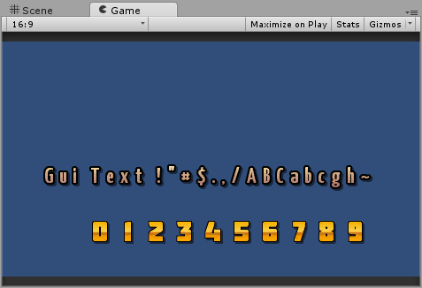
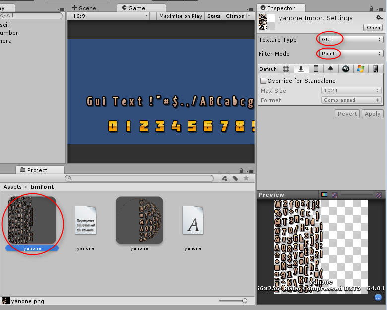
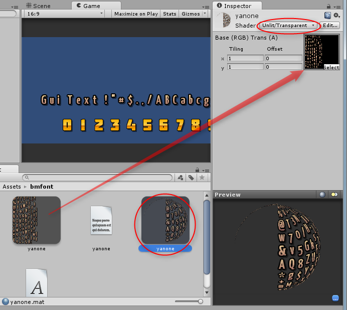
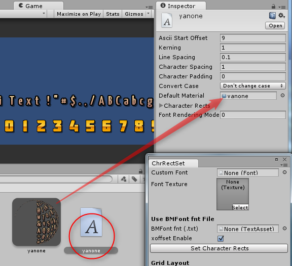
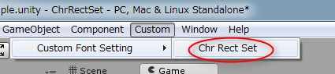
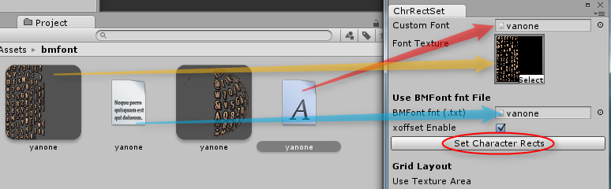
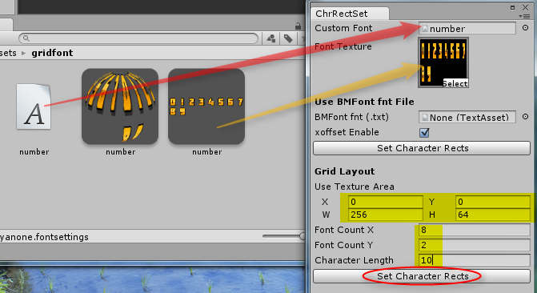

ChrRectSet.cs
=================

概要
---------

Unity の Custom Font を使うとビットマップフォントが表示できる。

しかし、使用する文字数分、Chracater Rects を設定しないといけない。
この Unity拡張は、その設定作業を自動化する。

以下の2種類の設定方法が選べる。

* BMFontから出力された、fntファイル内容を元にして設定。
* 等間隔で文字が配置されているビットマップフォント画像に対し、等間隔で分割して設定。

導入方法 / Install
-------------------

 Assets\Editor\ 以下に、ChrRectSet.cs をコピーする。

前準備
----------

ビットマップフォントを使う場合、以下の作業/Assetsの追加をしておく。

1. Assets に、ビットマップフォント画像をコピーして、以下を設定。 
   * Texture Type : GUI
   * Filter Mode : Point
   
2. Assets に、Material を追加して、以下を設定。
   * Texture に、ビットマップフォント画像をD&D。
   * Shader を、Unlit/Transparent にする。(Shader → Unlit → Transparent の順に選択)
   
3. Assets に、Custom Font を追加して、以下を設定。
   * Material に、先ほど追加した Material をD&D。
   
4. BMFontから出力されたfntファイルで設定したい場合は、fntファイルもAssetsにコピーする。その際、拡張子を、.fnt から .txt にリネームしておく。
5. Hierarchy に GUI Text 等を追加して、Font に、先ほど用意した Custom Font を D&D。

使い方 / Usage
----------------

ChrRectSet.cs が導入されていれば、Unity のメニューに Custom という項目が増えるはず。

Custom → Custom Font Setting → Chr Rect Set を選択すると、作業ウインドウが開く。

### BMFontから出力されたfntファイルを使う場合

1. Assets から、作業ウインドウに、以下をD&D。
   * 設定したい Custom Font
   * ビットマップフォント画像
   * fntファイル(.txtにリネームしたファイル)
2. Set Character Rects ボタンを押す。
3. Custom Font の Ascii Start Offset に、使う文字の一番最初のASCIIコードを入力。

### 等間隔に配置されたビットマップフォント画像を使う場合

1. Assets から、作業ウインドウに、以下をD&D。
   * 設定したい Custom Font
   * ビットマップフォント画像
2. Grid Layout 以下の項目を入力。
   * Use Texture Area : 画像内でフォント部分が置かれている領域を指定。
   * Font Count X : 横方向にいくつ文字があるか。
   * Font Count Y : 縦方向にいくつ文字があるか。
   * Character Length : 何文字分設定するか。
3. Set Character Rects ボタンを押す。
4. Custom Font の Ascii Start Offset に、使う文字の一番最初のASCIIコードを入力。

### 注意点

* 設定後、Custom Font の Character Rects を開いたり閉じたりしないと、Gameビュー(?)に反映されない模様。
* 0～9の数字だけを表示するなら、Ascii Start Offset は 48 (= '0')。
* 記号、数字、アルファベットを表示するなら、Ascii Start Offset は 32 (= ' ' (空白文字))。
* ShoeBox で出力した fnt なら、TAB文字情報も含まれてるので、Ascii Start Offset は 9 (= TAB文字)。

ライセンス / License
-------------------------

Public Domain

関連ツール / Tools
----------------------

* [BMFont - AngelCode.com](http://www.angelcode.com/products/bmfont/) - ビットマップフォント画像作成ツール。(Windows用)
* [ShoeBox](http://renderhjs.net/shoebox/) - 2Dゲーム制作に特化した画像編集ツール。Adobe AIR製。BMFont互換のビットマップフォント画像を作成可能。
* [hiero](http://code.google.com/p/libgdx/downloads/detail?name=hiero.jar) - Java製のビットマップフォント画像生成ツール。BMFont互換。

変更履歴 / Change Log
---------------------------

* 2014/02/13 Unity 4.3.3f1で動作するように修正。
* 2013/10/07 とりあえず作成

   